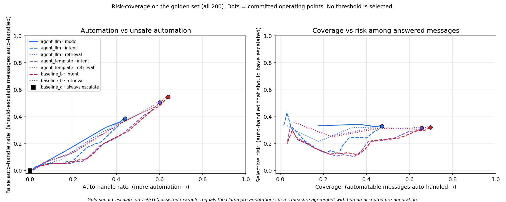

# Risk-coverage: the automation/safety tradeoff

**No threshold here is recommended.** Every row is a measurement on a fixed grid. Picking the best-looking row would be tuning on the evaluation set.

At threshold t a message is auto-handled only if the system auto-handled it **and** its confidence score is at least t. Row 0.0 is the system's committed operating point; higher thresholds add abstention. A threshold can only withhold automation, never add it, so no curve extends past its system's own automation level.

The operating point should be chosen from C_bad / C_human, the cost of an unsafe automated reply relative to a human handling the message. That cost cannot be inferred from tweets, so the cost columns sweep it (2, 8, 20) instead of assuming one.

**Disclosure.** On the 160 assisted examples, the gold `should_escalate` label matches the Llama pre-annotation on 159. All-200 curves measure agreement with human-accepted pre-annotation. The blind 40 were labelled from scratch.

Brackets are bootstrap 95% intervals (1,000 resamples). The full 0.05 grid is in `risk_coverage.json`; tables show every 0.1.

Score notes:
- `model_confidence`: self-reported by the generator LLM; uncalibrated
- `intent_confidence`: TF-IDF classifier probability, trained on weak labels; not calibrated on gold
- `retrieval_confidence`: top fused retrieval score, min-max normalised per query; relative, not a probability

## All 200

**baseline_a (always escalate):** auto-handle rate 0.0%, false auto-handle rate 0.0%, cost 1.00 at every ratio.

### agent_llm - `model_confidence`

| Threshold | Auto-handle rate | Coverage | False auto-handle rate | Unsafe (all msgs) | Selective risk | Intent acc (answered) | Escalation rate | Cost@2 | Cost@8 | Cost@20 |
|---|---|---|---|---|---|---|---|---|---|---|
| 0.0 | 44.0% (88) | 47.2% [38-56] | 38.7% [28-50] | 14.5% (29) | 33.0% | 55.7% | 56.0% | 0.85 | 1.72 | 3.46 |
| 0.1 | 44.0% (88) | 47.2% [38-56] | 38.7% [28-50] | 14.5% (29) | 33.0% | 55.7% | 56.0% | 0.85 | 1.72 | 3.46 |
| 0.2 | 44.0% (88) | 47.2% [38-56] | 38.7% [28-50] | 14.5% (29) | 33.0% | 55.7% | 56.0% | 0.85 | 1.72 | 3.46 |
| 0.3 | 44.0% (88) | 47.2% [38-56] | 38.7% [28-50] | 14.5% (29) | 33.0% | 55.7% | 56.0% | 0.85 | 1.72 | 3.46 |
| 0.4 | 44.0% (88) | 47.2% [38-56] | 38.7% [28-50] | 14.5% (29) | 33.0% | 55.7% | 56.0% | 0.85 | 1.72 | 3.46 |
| 0.5 | 44.0% (88) | 47.2% [38-56] | 38.7% [28-50] | 14.5% (29) | 33.0% | 55.7% | 56.0% | 0.85 | 1.72 | 3.46 |
| 0.6 | 44.0% (88) | 47.2% [38-56] | 38.7% [28-50] | 14.5% (29) | 33.0% | 55.7% | 56.0% | 0.85 | 1.72 | 3.46 |
| 0.7 | 44.0% (88) | 47.2% [38-56] | 38.7% [28-50] | 14.5% (29) | 33.0% | 55.7% | 56.0% | 0.85 | 1.72 | 3.46 |
| 0.8 | 43.5% (87) | 46.4% [37-55] | 38.7% [28-50] | 14.5% (29) | 33.3% | 55.2% | 56.5% | 0.85 | 1.73 | 3.46 |
| 0.9 | 35.0% (70) | 36.8% [28-45] | 32.0% [22-43] | 12.0% (24) | 34.3% | 55.7% | 65.0% | 0.89 | 1.61 | 3.05 |
| 1.0 | 0.0% (0) | 0.0% [0-0] | 0.0% [0-0] | 0.0% (0) | n/a | n/a | 100.0% | 1.00 | 1.00 | 1.00 |

### agent_llm - `intent_confidence`

| Threshold | Auto-handle rate | Coverage | False auto-handle rate | Unsafe (all msgs) | Selective risk | Intent acc (answered) | Escalation rate | Cost@2 | Cost@8 | Cost@20 |
|---|---|---|---|---|---|---|---|---|---|---|
| 0.0 | 44.0% (88) | 47.2% [38-56] | 38.7% [28-50] | 14.5% (29) | 33.0% | 55.7% | 56.0% | 0.85 | 1.72 | 3.46 |
| 0.1 | 44.0% (88) | 47.2% [38-56] | 38.7% [28-50] | 14.5% (29) | 33.0% | 55.7% | 56.0% | 0.85 | 1.72 | 3.46 |
| 0.2 | 41.0% (82) | 45.6% [37-55] | 33.3% [23-44] | 12.5% (25) | 30.5% | 58.5% | 59.0% | 0.84 | 1.59 | 3.09 |
| 0.3 | 33.0% (66) | 40.0% [31-49] | 21.3% [12-31] | 8.0% (16) | 24.2% | 60.6% | 67.0% | 0.83 | 1.31 | 2.27 |
| 0.4 | 26.5% (53) | 32.0% [24-40] | 17.3% [9-26] | 6.5% (13) | 24.5% | 60.4% | 73.5% | 0.86 | 1.25 | 2.04 |
| 0.5 | 19.5% (39) | 27.2% [19-35] | 6.7% [1-12] | 2.5% (5) | 12.8% | 64.1% | 80.5% | 0.85 | 1.00 | 1.30 |
| 0.6 | 15.0% (30) | 20.8% [14-28] | 5.3% [1-11] | 2.0% (4) | 13.3% | 60.0% | 85.0% | 0.89 | 1.01 | 1.25 |
| 0.7 | 13.0% (26) | 17.6% [11-25] | 5.3% [1-11] | 2.0% (4) | 15.4% | 65.4% | 87.0% | 0.91 | 1.03 | 1.27 |
| 0.8 | 7.5% (15) | 8.8% [4-14] | 5.3% [1-11] | 2.0% (4) | 26.7% | 66.7% | 92.5% | 0.96 | 1.08 | 1.32 |
| 0.9 | 3.5% (7) | 3.2% [1-7] | 4.0% [0-9] | 1.5% (3) | 42.9% | 85.7% | 96.5% | 0.99 | 1.08 | 1.26 |
| 1.0 | 0.0% (0) | 0.0% [0-0] | 0.0% [0-0] | 0.0% (0) | n/a | n/a | 100.0% | 1.00 | 1.00 | 1.00 |

### agent_llm - `retrieval_confidence`

| Threshold | Auto-handle rate | Coverage | False auto-handle rate | Unsafe (all msgs) | Selective risk | Intent acc (answered) | Escalation rate | Cost@2 | Cost@8 | Cost@20 |
|---|---|---|---|---|---|---|---|---|---|---|
| 0.0 | 44.0% (88) | 47.2% [38-56] | 38.7% [28-50] | 14.5% (29) | 33.0% | 55.7% | 56.0% | 0.85 | 1.72 | 3.46 |
| 0.1 | 44.0% (88) | 47.2% [38-56] | 38.7% [28-50] | 14.5% (29) | 33.0% | 55.7% | 56.0% | 0.85 | 1.72 | 3.46 |
| 0.2 | 44.0% (88) | 47.2% [38-56] | 38.7% [28-50] | 14.5% (29) | 33.0% | 55.7% | 56.0% | 0.85 | 1.72 | 3.46 |
| 0.3 | 44.0% (88) | 47.2% [38-56] | 38.7% [28-50] | 14.5% (29) | 33.0% | 55.7% | 56.0% | 0.85 | 1.72 | 3.46 |
| 0.4 | 44.0% (88) | 47.2% [38-56] | 38.7% [28-50] | 14.5% (29) | 33.0% | 55.7% | 56.0% | 0.85 | 1.72 | 3.46 |
| 0.5 | 44.0% (88) | 47.2% [38-56] | 38.7% [28-50] | 14.5% (29) | 33.0% | 55.7% | 56.0% | 0.85 | 1.72 | 3.46 |
| 0.6 | 44.0% (88) | 47.2% [38-56] | 38.7% [28-50] | 14.5% (29) | 33.0% | 55.7% | 56.0% | 0.85 | 1.72 | 3.46 |
| 0.7 | 44.0% (88) | 47.2% [38-56] | 38.7% [28-50] | 14.5% (29) | 33.0% | 55.7% | 56.0% | 0.85 | 1.72 | 3.46 |
| 0.8 | 43.5% (87) | 46.4% [38-55] | 38.7% [28-50] | 14.5% (29) | 33.3% | 56.3% | 56.5% | 0.85 | 1.73 | 3.46 |
| 0.9 | 30.0% (60) | 32.8% [25-41] | 25.3% [16-36] | 9.5% (19) | 31.7% | 53.3% | 70.0% | 0.89 | 1.46 | 2.60 |
| 1.0 | 3.0% (6) | 3.2% [1-7] | 2.7% [0-7] | 1.0% (2) | 33.3% | 50.0% | 97.0% | 0.99 | 1.05 | 1.17 |

### agent_template - `intent_confidence`

| Threshold | Auto-handle rate | Coverage | False auto-handle rate | Unsafe (all msgs) | Selective risk | Intent acc (answered) | Escalation rate | Cost@2 | Cost@8 | Cost@20 |
|---|---|---|---|---|---|---|---|---|---|---|
| 0.0 | 60.0% (120) | 65.6% [57-74] | 50.7% [40-62] | 19.0% (38) | 31.7% | 54.2% | 40.0% | 0.78 | 1.92 | 4.20 |
| 0.1 | 60.0% (120) | 65.6% [57-74] | 50.7% [40-62] | 19.0% (38) | 31.7% | 54.2% | 40.0% | 0.78 | 1.92 | 4.20 |
| 0.2 | 56.0% (112) | 63.2% [54-71] | 44.0% [33-55] | 16.5% (33) | 29.5% | 55.4% | 44.0% | 0.77 | 1.76 | 3.74 |
| 0.3 | 42.5% (85) | 52.0% [43-60] | 26.7% [17-37] | 10.0% (20) | 23.5% | 61.2% | 57.5% | 0.78 | 1.38 | 2.58 |
| 0.4 | 32.5% (65) | 40.8% [32-49] | 18.7% [10-28] | 7.0% (14) | 21.5% | 61.5% | 67.5% | 0.81 | 1.24 | 2.08 |
| 0.5 | 24.0% (48) | 34.4% [26-43] | 6.7% [1-12] | 2.5% (5) | 10.4% | 66.7% | 76.0% | 0.81 | 0.96 | 1.26 |
| 0.6 | 18.5% (37) | 26.4% [19-34] | 5.3% [1-11] | 2.0% (4) | 10.8% | 64.9% | 81.5% | 0.85 | 0.97 | 1.22 |
| 0.7 | 16.0% (32) | 22.4% [15-30] | 5.3% [1-11] | 2.0% (4) | 12.5% | 68.8% | 84.0% | 0.88 | 1.00 | 1.24 |
| 0.8 | 10.0% (20) | 12.8% [7-19] | 5.3% [1-11] | 2.0% (4) | 20.0% | 70.0% | 90.0% | 0.94 | 1.06 | 1.30 |
| 0.9 | 4.5% (9) | 4.8% [2-9] | 4.0% [0-9] | 1.5% (3) | 33.3% | 88.9% | 95.5% | 0.98 | 1.07 | 1.25 |
| 1.0 | 0.0% (0) | 0.0% [0-0] | 0.0% [0-0] | 0.0% (0) | n/a | n/a | 100.0% | 1.00 | 1.00 | 1.00 |

### agent_template - `retrieval_confidence`

| Threshold | Auto-handle rate | Coverage | False auto-handle rate | Unsafe (all msgs) | Selective risk | Intent acc (answered) | Escalation rate | Cost@2 | Cost@8 | Cost@20 |
|---|---|---|---|---|---|---|---|---|---|---|
| 0.0 | 60.0% (120) | 65.6% [57-74] | 50.7% [40-62] | 19.0% (38) | 31.7% | 54.2% | 40.0% | 0.78 | 1.92 | 4.20 |
| 0.1 | 60.0% (120) | 65.6% [57-74] | 50.7% [40-62] | 19.0% (38) | 31.7% | 54.2% | 40.0% | 0.78 | 1.92 | 4.20 |
| 0.2 | 60.0% (120) | 65.6% [57-74] | 50.7% [40-62] | 19.0% (38) | 31.7% | 54.2% | 40.0% | 0.78 | 1.92 | 4.20 |
| 0.3 | 60.0% (120) | 65.6% [57-74] | 50.7% [40-62] | 19.0% (38) | 31.7% | 54.2% | 40.0% | 0.78 | 1.92 | 4.20 |
| 0.4 | 60.0% (120) | 65.6% [57-74] | 50.7% [40-62] | 19.0% (38) | 31.7% | 54.2% | 40.0% | 0.78 | 1.92 | 4.20 |
| 0.5 | 60.0% (120) | 65.6% [57-74] | 50.7% [40-62] | 19.0% (38) | 31.7% | 54.2% | 40.0% | 0.78 | 1.92 | 4.20 |
| 0.6 | 60.0% (120) | 65.6% [57-74] | 50.7% [40-62] | 19.0% (38) | 31.7% | 54.2% | 40.0% | 0.78 | 1.92 | 4.20 |
| 0.7 | 60.0% (120) | 65.6% [57-74] | 50.7% [40-62] | 19.0% (38) | 31.7% | 54.2% | 40.0% | 0.78 | 1.92 | 4.20 |
| 0.8 | 59.0% (118) | 64.0% [55-72] | 50.7% [40-62] | 19.0% (38) | 32.2% | 54.2% | 41.0% | 0.79 | 1.93 | 4.21 |
| 0.9 | 39.5% (79) | 43.2% [34-52] | 33.3% [23-44] | 12.5% (25) | 31.6% | 50.6% | 60.5% | 0.85 | 1.60 | 3.10 |
| 1.0 | 5.5% (11) | 5.6% [2-10] | 5.3% [1-11] | 2.0% (4) | 36.4% | 45.5% | 94.5% | 0.98 | 1.10 | 1.34 |

### baseline_b - `intent_confidence`

| Threshold | Auto-handle rate | Coverage | False auto-handle rate | Unsafe (all msgs) | Selective risk | Intent acc (answered) | Escalation rate | Cost@2 | Cost@8 | Cost@20 |
|---|---|---|---|---|---|---|---|---|---|---|
| 0.0 | 64.0% (128) | 69.6% [61-78] | 54.7% [43-65] | 20.5% (41) | 32.0% | 53.9% | 36.0% | 0.77 | 2.00 | 4.46 |
| 0.1 | 64.0% (128) | 69.6% [61-78] | 54.7% [43-65] | 20.5% (41) | 32.0% | 53.9% | 36.0% | 0.77 | 2.00 | 4.46 |
| 0.2 | 60.0% (120) | 67.2% [59-75] | 48.0% [37-59] | 18.0% (36) | 30.0% | 55.0% | 40.0% | 0.76 | 1.84 | 4.00 |
| 0.3 | 45.5% (91) | 55.2% [46-63] | 29.3% [19-40] | 11.0% (22) | 24.2% | 61.5% | 54.5% | 0.77 | 1.43 | 2.75 |
| 0.4 | 34.0% (68) | 42.4% [34-51] | 20.0% [11-30] | 7.5% (15) | 22.1% | 63.2% | 66.0% | 0.81 | 1.26 | 2.16 |
| 0.5 | 25.5% (51) | 36.0% [28-44] | 8.0% [2-14] | 3.0% (6) | 11.8% | 68.6% | 74.5% | 0.81 | 0.98 | 1.34 |
| 0.6 | 20.0% (40) | 28.0% [21-36] | 6.7% [1-13] | 2.5% (5) | 12.5% | 67.5% | 80.0% | 0.85 | 1.00 | 1.30 |
| 0.7 | 16.5% (33) | 23.2% [16-30] | 5.3% [1-11] | 2.0% (4) | 12.1% | 69.7% | 83.5% | 0.88 | 0.99 | 1.24 |
| 0.8 | 10.5% (21) | 13.6% [8-20] | 5.3% [1-11] | 2.0% (4) | 19.0% | 71.4% | 89.5% | 0.94 | 1.05 | 1.29 |
| 0.9 | 5.0% (10) | 5.6% [2-10] | 4.0% [0-9] | 1.5% (3) | 30.0% | 90.0% | 95.0% | 0.98 | 1.07 | 1.25 |
| 1.0 | 0.0% (0) | 0.0% [0-0] | 0.0% [0-0] | 0.0% (0) | n/a | n/a | 100.0% | 1.00 | 1.00 | 1.00 |

### baseline_b - `retrieval_confidence`

| Threshold | Auto-handle rate | Coverage | False auto-handle rate | Unsafe (all msgs) | Selective risk | Intent acc (answered) | Escalation rate | Cost@2 | Cost@8 | Cost@20 |
|---|---|---|---|---|---|---|---|---|---|---|
| 0.0 | 64.0% (128) | 69.6% [61-78] | 54.7% [43-65] | 20.5% (41) | 32.0% | 53.9% | 36.0% | 0.77 | 2.00 | 4.46 |
| 0.1 | 64.0% (128) | 69.6% [61-78] | 54.7% [43-65] | 20.5% (41) | 32.0% | 53.9% | 36.0% | 0.77 | 2.00 | 4.46 |
| 0.2 | 64.0% (128) | 69.6% [61-78] | 54.7% [43-65] | 20.5% (41) | 32.0% | 53.9% | 36.0% | 0.77 | 2.00 | 4.46 |
| 0.3 | 64.0% (128) | 69.6% [61-78] | 54.7% [43-65] | 20.5% (41) | 32.0% | 53.9% | 36.0% | 0.77 | 2.00 | 4.46 |
| 0.4 | 64.0% (128) | 69.6% [61-78] | 54.7% [43-65] | 20.5% (41) | 32.0% | 53.9% | 36.0% | 0.77 | 2.00 | 4.46 |
| 0.5 | 64.0% (128) | 69.6% [61-78] | 54.7% [43-65] | 20.5% (41) | 32.0% | 53.9% | 36.0% | 0.77 | 2.00 | 4.46 |
| 0.6 | 64.0% (128) | 69.6% [61-78] | 54.7% [43-65] | 20.5% (41) | 32.0% | 53.9% | 36.0% | 0.77 | 2.00 | 4.46 |
| 0.7 | 64.0% (128) | 69.6% [61-78] | 54.7% [43-65] | 20.5% (41) | 32.0% | 53.9% | 36.0% | 0.77 | 2.00 | 4.46 |
| 0.8 | 63.0% (126) | 68.0% [59-76] | 54.7% [43-65] | 20.5% (41) | 32.5% | 54.0% | 37.0% | 0.78 | 2.01 | 4.47 |
| 0.9 | 41.5% (83) | 45.6% [37-54] | 34.7% [25-45] | 13.0% (26) | 31.3% | 51.8% | 58.5% | 0.84 | 1.62 | 3.19 |
| 1.0 | 5.5% (11) | 5.6% [2-10] | 5.3% [1-11] | 2.0% (4) | 36.4% | 45.5% | 94.5% | 0.98 | 1.10 | 1.34 |

## Blind 40 (labelled from scratch)

**baseline_a (always escalate):** auto-handle rate 0.0%, false auto-handle rate 0.0%, cost 1.00 at every ratio.

### agent_llm - `model_confidence`

| Threshold | Auto-handle rate | Coverage | False auto-handle rate | Unsafe (all msgs) | Selective risk | Intent acc (answered) | Escalation rate | Cost@2 | Cost@8 | Cost@20 |
|---|---|---|---|---|---|---|---|---|---|---|
| 0.0 | 35.0% (14) | 43.5% [24-63] | 23.5% [5-44] | 10.0% (4) | 28.6% | 57.1% | 65.0% | 0.85 | 1.45 | 2.65 |
| 0.1 | 35.0% (14) | 43.5% [24-63] | 23.5% [5-44] | 10.0% (4) | 28.6% | 57.1% | 65.0% | 0.85 | 1.45 | 2.65 |
| 0.2 | 35.0% (14) | 43.5% [24-63] | 23.5% [5-44] | 10.0% (4) | 28.6% | 57.1% | 65.0% | 0.85 | 1.45 | 2.65 |
| 0.3 | 35.0% (14) | 43.5% [24-63] | 23.5% [5-44] | 10.0% (4) | 28.6% | 57.1% | 65.0% | 0.85 | 1.45 | 2.65 |
| 0.4 | 35.0% (14) | 43.5% [24-63] | 23.5% [5-44] | 10.0% (4) | 28.6% | 57.1% | 65.0% | 0.85 | 1.45 | 2.65 |
| 0.5 | 35.0% (14) | 43.5% [24-63] | 23.5% [5-44] | 10.0% (4) | 28.6% | 57.1% | 65.0% | 0.85 | 1.45 | 2.65 |
| 0.6 | 35.0% (14) | 43.5% [24-63] | 23.5% [5-44] | 10.0% (4) | 28.6% | 57.1% | 65.0% | 0.85 | 1.45 | 2.65 |
| 0.7 | 35.0% (14) | 43.5% [24-63] | 23.5% [5-44] | 10.0% (4) | 28.6% | 57.1% | 65.0% | 0.85 | 1.45 | 2.65 |
| 0.8 | 35.0% (14) | 43.5% [24-63] | 23.5% [5-44] | 10.0% (4) | 28.6% | 57.1% | 65.0% | 0.85 | 1.45 | 2.65 |
| 0.9 | 27.5% (11) | 34.8% [17-55] | 17.6% [0-38] | 7.5% (3) | 27.3% | 63.6% | 72.5% | 0.88 | 1.32 | 2.23 |
| 1.0 | 0.0% (0) | 0.0% [0-0] | 0.0% [0-0] | 0.0% (0) | n/a | n/a | 100.0% | 1.00 | 1.00 | 1.00 |

### agent_llm - `intent_confidence`

| Threshold | Auto-handle rate | Coverage | False auto-handle rate | Unsafe (all msgs) | Selective risk | Intent acc (answered) | Escalation rate | Cost@2 | Cost@8 | Cost@20 |
|---|---|---|---|---|---|---|---|---|---|---|
| 0.0 | 35.0% (14) | 43.5% [24-63] | 23.5% [5-44] | 10.0% (4) | 28.6% | 57.1% | 65.0% | 0.85 | 1.45 | 2.65 |
| 0.1 | 35.0% (14) | 43.5% [24-63] | 23.5% [5-44] | 10.0% (4) | 28.6% | 57.1% | 65.0% | 0.85 | 1.45 | 2.65 |
| 0.2 | 35.0% (14) | 43.5% [24-63] | 23.5% [5-44] | 10.0% (4) | 28.6% | 57.1% | 65.0% | 0.85 | 1.45 | 2.65 |
| 0.3 | 30.0% (12) | 39.1% [19-59] | 17.6% [0-38] | 7.5% (3) | 25.0% | 66.7% | 70.0% | 0.85 | 1.30 | 2.20 |
| 0.4 | 25.0% (10) | 34.8% [16-55] | 11.8% [0-28] | 5.0% (2) | 20.0% | 60.0% | 75.0% | 0.85 | 1.15 | 1.75 |
| 0.5 | 17.5% (7) | 30.4% [13-50] | 0.0% [0-0] | 0.0% (0) | 0.0% | 85.7% | 82.5% | 0.82 | 0.82 | 0.82 |
| 0.6 | 12.5% (5) | 21.7% [5-40] | 0.0% [0-0] | 0.0% (0) | 0.0% | 80.0% | 87.5% | 0.88 | 0.88 | 0.88 |
| 0.7 | 7.5% (3) | 13.0% [0-29] | 0.0% [0-0] | 0.0% (0) | 0.0% | 100.0% | 92.5% | 0.93 | 0.93 | 0.93 |
| 0.8 | 5.0% (2) | 8.7% [0-23] | 0.0% [0-0] | 0.0% (0) | 0.0% | 100.0% | 95.0% | 0.95 | 0.95 | 0.95 |
| 0.9 | 0.0% (0) | 0.0% [0-0] | 0.0% [0-0] | 0.0% (0) | n/a | n/a | 100.0% | 1.00 | 1.00 | 1.00 |
| 1.0 | 0.0% (0) | 0.0% [0-0] | 0.0% [0-0] | 0.0% (0) | n/a | n/a | 100.0% | 1.00 | 1.00 | 1.00 |

### agent_llm - `retrieval_confidence`

| Threshold | Auto-handle rate | Coverage | False auto-handle rate | Unsafe (all msgs) | Selective risk | Intent acc (answered) | Escalation rate | Cost@2 | Cost@8 | Cost@20 |
|---|---|---|---|---|---|---|---|---|---|---|
| 0.0 | 35.0% (14) | 43.5% [24-63] | 23.5% [5-44] | 10.0% (4) | 28.6% | 57.1% | 65.0% | 0.85 | 1.45 | 2.65 |
| 0.1 | 35.0% (14) | 43.5% [24-63] | 23.5% [5-44] | 10.0% (4) | 28.6% | 57.1% | 65.0% | 0.85 | 1.45 | 2.65 |
| 0.2 | 35.0% (14) | 43.5% [24-63] | 23.5% [5-44] | 10.0% (4) | 28.6% | 57.1% | 65.0% | 0.85 | 1.45 | 2.65 |
| 0.3 | 35.0% (14) | 43.5% [24-63] | 23.5% [5-44] | 10.0% (4) | 28.6% | 57.1% | 65.0% | 0.85 | 1.45 | 2.65 |
| 0.4 | 35.0% (14) | 43.5% [24-63] | 23.5% [5-44] | 10.0% (4) | 28.6% | 57.1% | 65.0% | 0.85 | 1.45 | 2.65 |
| 0.5 | 35.0% (14) | 43.5% [24-63] | 23.5% [5-44] | 10.0% (4) | 28.6% | 57.1% | 65.0% | 0.85 | 1.45 | 2.65 |
| 0.6 | 35.0% (14) | 43.5% [24-63] | 23.5% [5-44] | 10.0% (4) | 28.6% | 57.1% | 65.0% | 0.85 | 1.45 | 2.65 |
| 0.7 | 35.0% (14) | 43.5% [24-63] | 23.5% [5-44] | 10.0% (4) | 28.6% | 57.1% | 65.0% | 0.85 | 1.45 | 2.65 |
| 0.8 | 35.0% (14) | 43.5% [24-63] | 23.5% [5-44] | 10.0% (4) | 28.6% | 57.1% | 65.0% | 0.85 | 1.45 | 2.65 |
| 0.9 | 32.5% (13) | 43.5% [24-63] | 17.6% [0-38] | 7.5% (3) | 23.1% | 61.5% | 67.5% | 0.82 | 1.27 | 2.17 |
| 1.0 | 2.5% (1) | 4.3% [0-14] | 0.0% [0-0] | 0.0% (0) | 0.0% | 100.0% | 97.5% | 0.97 | 0.97 | 0.97 |

### agent_template - `intent_confidence`

| Threshold | Auto-handle rate | Coverage | False auto-handle rate | Unsafe (all msgs) | Selective risk | Intent acc (answered) | Escalation rate | Cost@2 | Cost@8 | Cost@20 |
|---|---|---|---|---|---|---|---|---|---|---|
| 0.0 | 52.5% (21) | 60.9% [40-79] | 41.2% [18-65] | 17.5% (7) | 33.3% | 47.6% | 47.5% | 0.82 | 1.88 | 3.98 |
| 0.1 | 52.5% (21) | 60.9% [40-79] | 41.2% [18-65] | 17.5% (7) | 33.3% | 47.6% | 47.5% | 0.82 | 1.88 | 3.98 |
| 0.2 | 52.5% (21) | 60.9% [40-79] | 41.2% [18-65] | 17.5% (7) | 33.3% | 47.6% | 47.5% | 0.82 | 1.88 | 3.98 |
| 0.3 | 40.0% (16) | 52.2% [32-71] | 23.5% [5-45] | 10.0% (4) | 25.0% | 62.5% | 60.0% | 0.80 | 1.40 | 2.60 |
| 0.4 | 30.0% (12) | 43.5% [24-63] | 11.8% [0-28] | 5.0% (2) | 16.7% | 58.3% | 70.0% | 0.80 | 1.10 | 1.70 |
| 0.5 | 17.5% (7) | 30.4% [13-50] | 0.0% [0-0] | 0.0% (0) | 0.0% | 85.7% | 82.5% | 0.82 | 0.82 | 0.82 |
| 0.6 | 12.5% (5) | 21.7% [5-40] | 0.0% [0-0] | 0.0% (0) | 0.0% | 80.0% | 87.5% | 0.88 | 0.88 | 0.88 |
| 0.7 | 7.5% (3) | 13.0% [0-29] | 0.0% [0-0] | 0.0% (0) | 0.0% | 100.0% | 92.5% | 0.93 | 0.93 | 0.93 |
| 0.8 | 5.0% (2) | 8.7% [0-23] | 0.0% [0-0] | 0.0% (0) | 0.0% | 100.0% | 95.0% | 0.95 | 0.95 | 0.95 |
| 0.9 | 0.0% (0) | 0.0% [0-0] | 0.0% [0-0] | 0.0% (0) | n/a | n/a | 100.0% | 1.00 | 1.00 | 1.00 |
| 1.0 | 0.0% (0) | 0.0% [0-0] | 0.0% [0-0] | 0.0% (0) | n/a | n/a | 100.0% | 1.00 | 1.00 | 1.00 |

### agent_template - `retrieval_confidence`

| Threshold | Auto-handle rate | Coverage | False auto-handle rate | Unsafe (all msgs) | Selective risk | Intent acc (answered) | Escalation rate | Cost@2 | Cost@8 | Cost@20 |
|---|---|---|---|---|---|---|---|---|---|---|
| 0.0 | 52.5% (21) | 60.9% [40-79] | 41.2% [18-65] | 17.5% (7) | 33.3% | 47.6% | 47.5% | 0.82 | 1.88 | 3.98 |
| 0.1 | 52.5% (21) | 60.9% [40-79] | 41.2% [18-65] | 17.5% (7) | 33.3% | 47.6% | 47.5% | 0.82 | 1.88 | 3.98 |
| 0.2 | 52.5% (21) | 60.9% [40-79] | 41.2% [18-65] | 17.5% (7) | 33.3% | 47.6% | 47.5% | 0.82 | 1.88 | 3.98 |
| 0.3 | 52.5% (21) | 60.9% [40-79] | 41.2% [18-65] | 17.5% (7) | 33.3% | 47.6% | 47.5% | 0.82 | 1.88 | 3.98 |
| 0.4 | 52.5% (21) | 60.9% [40-79] | 41.2% [18-65] | 17.5% (7) | 33.3% | 47.6% | 47.5% | 0.82 | 1.88 | 3.98 |
| 0.5 | 52.5% (21) | 60.9% [40-79] | 41.2% [18-65] | 17.5% (7) | 33.3% | 47.6% | 47.5% | 0.82 | 1.88 | 3.98 |
| 0.6 | 52.5% (21) | 60.9% [40-79] | 41.2% [18-65] | 17.5% (7) | 33.3% | 47.6% | 47.5% | 0.82 | 1.88 | 3.98 |
| 0.7 | 52.5% (21) | 60.9% [40-79] | 41.2% [18-65] | 17.5% (7) | 33.3% | 47.6% | 47.5% | 0.82 | 1.88 | 3.98 |
| 0.8 | 52.5% (21) | 60.9% [40-79] | 41.2% [18-65] | 17.5% (7) | 33.3% | 47.6% | 47.5% | 0.82 | 1.88 | 3.98 |
| 0.9 | 42.5% (17) | 52.2% [32-73] | 29.4% [9-50] | 12.5% (5) | 29.4% | 52.9% | 57.5% | 0.82 | 1.57 | 3.08 |
| 1.0 | 5.0% (2) | 4.3% [0-14] | 5.9% [0-20] | 2.5% (1) | 50.0% | 50.0% | 95.0% | 1.00 | 1.15 | 1.45 |

### baseline_b - `intent_confidence`

| Threshold | Auto-handle rate | Coverage | False auto-handle rate | Unsafe (all msgs) | Selective risk | Intent acc (answered) | Escalation rate | Cost@2 | Cost@8 | Cost@20 |
|---|---|---|---|---|---|---|---|---|---|---|
| 0.0 | 55.0% (22) | 65.2% [44-83] | 41.2% [18-65] | 17.5% (7) | 31.8% | 45.5% | 45.0% | 0.80 | 1.85 | 3.95 |
| 0.1 | 55.0% (22) | 65.2% [44-83] | 41.2% [18-65] | 17.5% (7) | 31.8% | 45.5% | 45.0% | 0.80 | 1.85 | 3.95 |
| 0.2 | 55.0% (22) | 65.2% [44-83] | 41.2% [18-65] | 17.5% (7) | 31.8% | 45.5% | 45.0% | 0.80 | 1.85 | 3.95 |
| 0.3 | 40.0% (16) | 52.2% [32-71] | 23.5% [5-45] | 10.0% (4) | 25.0% | 62.5% | 60.0% | 0.80 | 1.40 | 2.60 |
| 0.4 | 30.0% (12) | 43.5% [24-63] | 11.8% [0-28] | 5.0% (2) | 16.7% | 58.3% | 70.0% | 0.80 | 1.10 | 1.70 |
| 0.5 | 17.5% (7) | 30.4% [13-50] | 0.0% [0-0] | 0.0% (0) | 0.0% | 85.7% | 82.5% | 0.82 | 0.82 | 0.82 |
| 0.6 | 12.5% (5) | 21.7% [5-40] | 0.0% [0-0] | 0.0% (0) | 0.0% | 80.0% | 87.5% | 0.88 | 0.88 | 0.88 |
| 0.7 | 7.5% (3) | 13.0% [0-29] | 0.0% [0-0] | 0.0% (0) | 0.0% | 100.0% | 92.5% | 0.93 | 0.93 | 0.93 |
| 0.8 | 5.0% (2) | 8.7% [0-23] | 0.0% [0-0] | 0.0% (0) | 0.0% | 100.0% | 95.0% | 0.95 | 0.95 | 0.95 |
| 0.9 | 0.0% (0) | 0.0% [0-0] | 0.0% [0-0] | 0.0% (0) | n/a | n/a | 100.0% | 1.00 | 1.00 | 1.00 |
| 1.0 | 0.0% (0) | 0.0% [0-0] | 0.0% [0-0] | 0.0% (0) | n/a | n/a | 100.0% | 1.00 | 1.00 | 1.00 |

### baseline_b - `retrieval_confidence`

| Threshold | Auto-handle rate | Coverage | False auto-handle rate | Unsafe (all msgs) | Selective risk | Intent acc (answered) | Escalation rate | Cost@2 | Cost@8 | Cost@20 |
|---|---|---|---|---|---|---|---|---|---|---|
| 0.0 | 55.0% (22) | 65.2% [44-83] | 41.2% [18-65] | 17.5% (7) | 31.8% | 45.5% | 45.0% | 0.80 | 1.85 | 3.95 |
| 0.1 | 55.0% (22) | 65.2% [44-83] | 41.2% [18-65] | 17.5% (7) | 31.8% | 45.5% | 45.0% | 0.80 | 1.85 | 3.95 |
| 0.2 | 55.0% (22) | 65.2% [44-83] | 41.2% [18-65] | 17.5% (7) | 31.8% | 45.5% | 45.0% | 0.80 | 1.85 | 3.95 |
| 0.3 | 55.0% (22) | 65.2% [44-83] | 41.2% [18-65] | 17.5% (7) | 31.8% | 45.5% | 45.0% | 0.80 | 1.85 | 3.95 |
| 0.4 | 55.0% (22) | 65.2% [44-83] | 41.2% [18-65] | 17.5% (7) | 31.8% | 45.5% | 45.0% | 0.80 | 1.85 | 3.95 |
| 0.5 | 55.0% (22) | 65.2% [44-83] | 41.2% [18-65] | 17.5% (7) | 31.8% | 45.5% | 45.0% | 0.80 | 1.85 | 3.95 |
| 0.6 | 55.0% (22) | 65.2% [44-83] | 41.2% [18-65] | 17.5% (7) | 31.8% | 45.5% | 45.0% | 0.80 | 1.85 | 3.95 |
| 0.7 | 55.0% (22) | 65.2% [44-83] | 41.2% [18-65] | 17.5% (7) | 31.8% | 45.5% | 45.0% | 0.80 | 1.85 | 3.95 |
| 0.8 | 55.0% (22) | 65.2% [44-83] | 41.2% [18-65] | 17.5% (7) | 31.8% | 45.5% | 45.0% | 0.80 | 1.85 | 3.95 |
| 0.9 | 45.0% (18) | 56.5% [35-77] | 29.4% [9-50] | 12.5% (5) | 27.8% | 50.0% | 55.0% | 0.80 | 1.55 | 3.05 |
| 1.0 | 5.0% (2) | 4.3% [0-14] | 5.9% [0-20] | 2.5% (1) | 50.0% | 50.0% | 95.0% | 1.00 | 1.15 | 1.45 |

